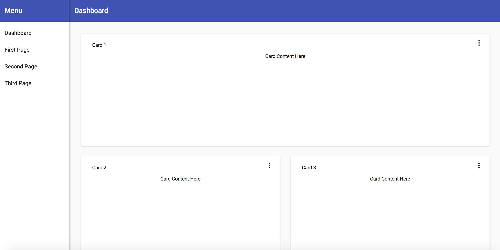
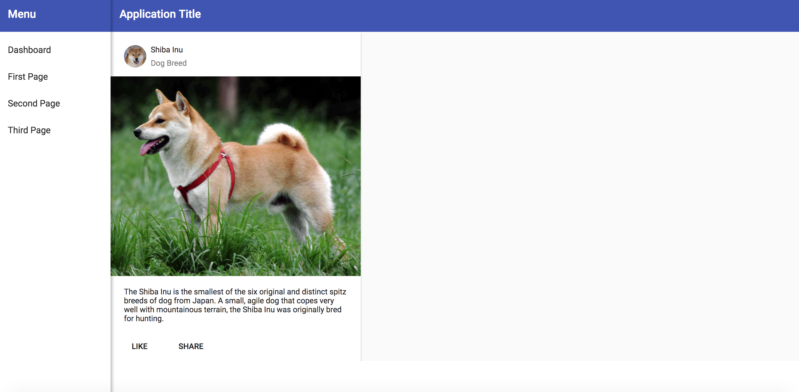

# Laravel 5.6 + Angular 6 + Material Design

This is a simple Single Page Application starter for [Laravel 5.6.x](https://laravel.com) + [Angular 6](https://angular.io/) and [Material Design](https://material.io/design/).

### Screenshots

## Installation

- Clone the repository
- then run `composer install` and follow Laravel [documentation](https://laravel.com/docs/5.6)
- and then run `npm install` inside `resources/assets/src/angular-app` directory and follow [Angular CLI Documentation](https://github.com/angular/angular-cli)

## Development server

Run `ng serve` for a dev server. Navigate to `http://localhost:4200/`. The app will automatically reload if you change any of the source files.

## Code scaffolding

Run `ng generate component component-name` to generate a new component. You can also use `ng generate directive|pipe|service|class|guard|interface|enum|module`.

## Build

Run `ng build` to build the project. The build artifacts will be stored in the `dist/` directory. Use the `-prod` flag for a production build. When running the command `ng build` the `dist/` directory will be generated inside the Laravel `public/` directory.

## Running unit tests

Run `ng test` to execute the unit tests via [Karma](https://karma-runner.github.io).

## Running end-to-end tests

Run `ng e2e` to execute the end-to-end tests via [Protractor](http://www.protractortest.org/).

## Further help

To get more help on the Angular CLI use `ng help` or go check out the [Angular CLI README](https://github.com/angular/angular-cli/blob/master/README.md).
 
If you have any questions please use the Issues tab or submit a pull request. I tried to keep this as simple as possible just the basic form of a starter repository to be able to use Angular 6 with Laravel 5.6 as the backend.

### License
This project is open-sourced software licensed under the [MIT license](https://opensource.org/licenses/MIT).
